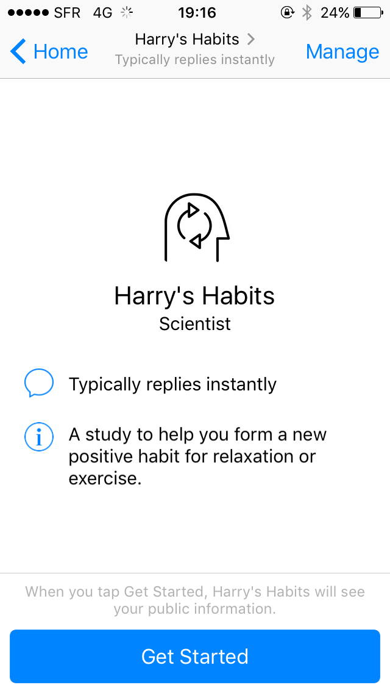
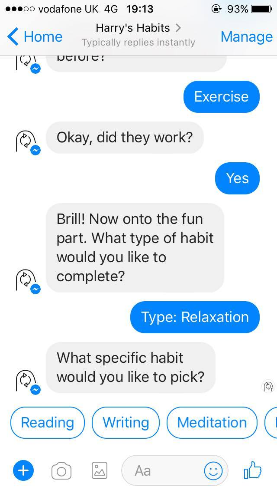
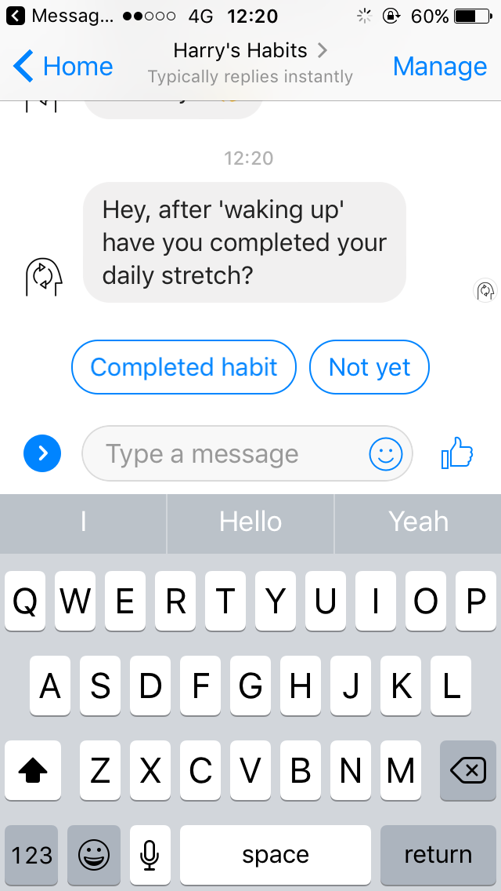
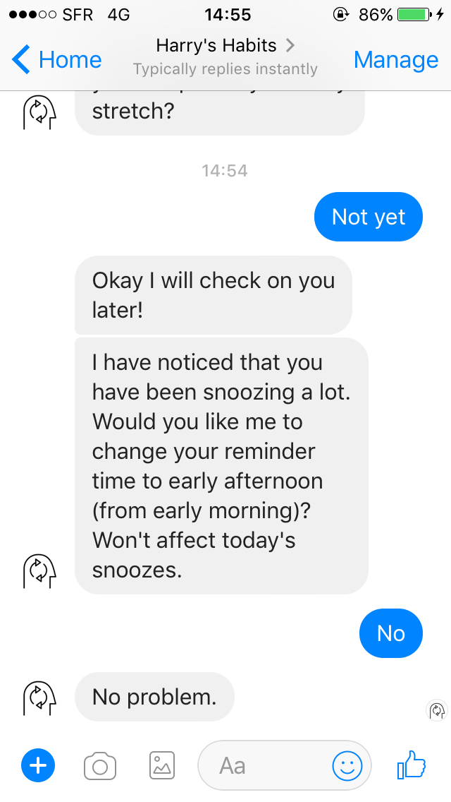

## Harry's Habits - the habit tracking chatbot

Harry's Habits is a Facebook Messenger chatbot to help you form new healthy habits (part of my [MSc thesis](https://www.harrymt.com)).

### Development

- *Setup*: Follow the [setup guide](#setup)
- *Build*: `npm install` then `npm start`
- *Deploy*: `npm run deploy`

### Setup

#### PaaS

- `git clone https://github.com/harrymt/harryshabits.git` then deploy to PaaS, e.g. `git push heroku master`
- *PaaS providers for deployment:*
  - [Heroku](https://www.heroku.com/) (recommended)
  - [Google App Engine](https://cloud.google.com/appengine/)
  - [Now.sh](https://zeit.co/now)

#### Database

- *Database providers for storing user data:*
  - Heroku [PostgreSQL](https://www.postgresql.org/) with [postgres addon](https://elements.heroku.com/addons/heroku-postgresql) (10k rows for free) (recommended)
  - [Airtable](https://airtable.com/) (2k rows for free)

#### Facebook Messenger

- Create page and get page id
- Generate access token
- [Whitelist your domain](https://developers.facebook.com/docs/messenger-platform/webview/extensions)
- Add a [Get Started Button](https://developers.facebook.com/docs/messenger-platform/messenger-profile/get-started-button)

#### Configuration

- `mv .env.example .example` then change values

### Attribution

- *Audio* from [AudioBlocks](https://www.audioblocks.com/stock-audio/)
- *Logo* from [the Noun Project by Yu luck](https://thenounproject.com/term/custom/402041/)
- *Gifs* from [Gif Sound](gifsound.com) [A](https://gifsound.com/?gif=i.imgur.com/DWGKg.gif&v=hwhvByj8YG8&s=10), [B](https://gifsound.com/?gif=s.pikabu.ru/images/previews_comm/2012-09_3/13476044801789.gif&v=E-WHW-QNswE&s=25), [C](https://gifsound.com/?gif=i.imgur.com/1Asrg.gif&v=M11SvDtPBhA&s=45) and [D](https://gifsound.com/?gif=i.imgur.com/SXoCvIw.gif&v=Jmd4OLzhQw0&s=33)
